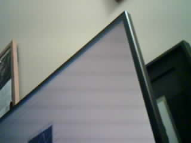
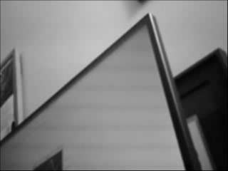
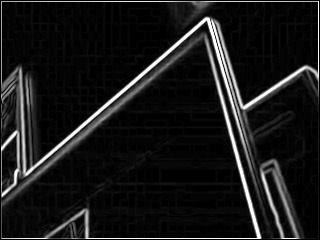
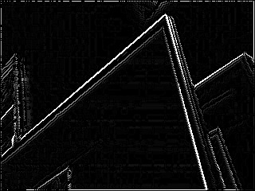
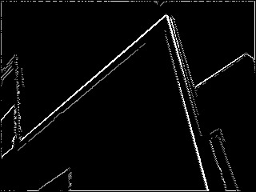

# BlueCam

## Hardware Requirements
1. [Arduino Uno R3 microcontroller.](https://www.amazon.ca/Elegoo-Board-ATmega328P-ATMEGA16U2-Arduino/dp/B01EWOE0UU/)
2. [ArduCAM OV2640 Mini 2MP Plus camera module.](https://www.amazon.ca/Arducam-Module-Megapixels-Arduino-Mega2560/dp/B012UXNDOY/)
3. [HC-05 Bluetooth module.](https://www.amazon.ca/DSD-TECH-HC-05-Pass-Through-Communication/dp/B01G9KSAF6/)
4. An Ubuntu (or Debian-based?) laptop with Bluetooth capabilities.

## Software Requirements
- `sudo apt install libjpeg-turbo8-dev libsdl2-dev libpthread-stubs0-dev`
    - somehow, `sudo apt install libjpeg-dev` only installs documentation and
      a copyright text...?
## Hardware Setup

## Software Setup

Build
-----
1. `sudo apt install libjpeg-turbo8-dev libsdl2-dev libpthread-stubs0-dev`;
    - somehow, `sudo apt install libjpeg-dev` only installs documentation and
      a copyright text...?

Goal
----
- challenge myself technically
- make a dashboard camera that can record video and read license plates within
  2-3 weeks during evening and weekend hours

Project details
-------
- dashboard camera consists of:
    - Arduino Uno R3 (micro controller)
    - OV2640 camera (2 Megapixels)
    - HC-05 Bluetooth
    * I had time constraints and the Uno R3 + HC-05 was available from my
      brother-in-law at the time. I was looking into image processing at the
      time and wrote a preliminary Canny edge detection algorithm. It seemed
      natural to simply buy an Arduino camera to try and attempt image
      processing in real-time. The OV2640 was the only one that can interface
      with the Uno R3 using the CSI interface. Also, the Amazon reviews of the
      camera indicated that other people have had success using the camera on
      the Uno R3 despite its limited processing speed.
- image processing server consists of:
    - C++ binary running on a Linux laptop and communicating with the camera via Bluetooth
    - image processing library written in C++ and built using CMake
    - I opted for a C++ binary run from a Bluetooth compatible laptop instead of the Android image processing server component; I wanted to focus more on the computer vision algorithms and embedded software rather than Android development

- Bluetooth needs 3.5V input but Arduino outputs 5V so I needed to order
  resistors along with my camera

Software Architecture Details
-------
The Arduino camera uses a Bluetooth module that emulates serial port communication and transmits image data in JPEG format. See [`loop()`](./arduino/dashcam/dashcam.ino); I took sample code from the camera module's vendor and refactored it to support the OV2640 model.

The [video server](videoserver.cpp) uses [SDL](https://github.com/libsdl-org/SDL) to display the image processing pipeline's output for development and debugging purposes. Its `main()` loop calls all the computer-vision-related image processing functions declared in [`utility.hpp`](utility.hpp). All the GUI-related code is in its own namespace and I intend to split them into a separate class *soon*.

I chose to store each frame as a 1D vector over a 2D vector for better data locality. Pixel coordinates can simply be calculated as `y + x * row length`.

The sample pictures below is the top-right edge of my monitor to demonstrate edge detection.

The image pipeline functions are implemented in [`utility.cpp`](utility.cpp) and so far consists of:

1. converting JPEG frame to greyscale

2. smoothing the greyscale image using Gaussian blur
-- note that one pass of a 2D Gaussian kernel is equivalent to 2 passes of a 1D horizontal Gaussian kernel and one vertical Gaussian kernel; this optimization removes 1 layer of for loop!

3. detect edges by convolving the greyscale image with horizontal and vertical Sobel operators or kernels

4. cleanup very thick edges by suppressing unnecessary repeated edges or nonmax edges

5. cleanup insignificant edges or false positives by:

    a. computing the Otsu threshold, which takes in the edge image after nonmax edge suppression and plots a histogram of black intensity values from 0 to 256 and then calculates a threshold intensity value that can split the intensity histogram or distribution into 2 parts

    b. apply hysteresis edge filtering using the threshold computed from Otsu's method to discard weak-intensity edges straightaway and discard medium-intensity edges IF they are not close to any strong-intensity edges

Note that all the steps make up the process of Canny edge detection.

Finally, the video server calls `UpdateGrayFrame()` to render the output to the screen.

Outcome
-------
- I did not finish the license plate reader but did implement the Canny edge detection.
- I implemented RGB to grayscale processing, Gaussian blurring, Sobel edge detection, non-maximum edge suppression, Otsu thresholding, and hysteresis edge filtering.
- I learnt more about Arduino hardware development.

